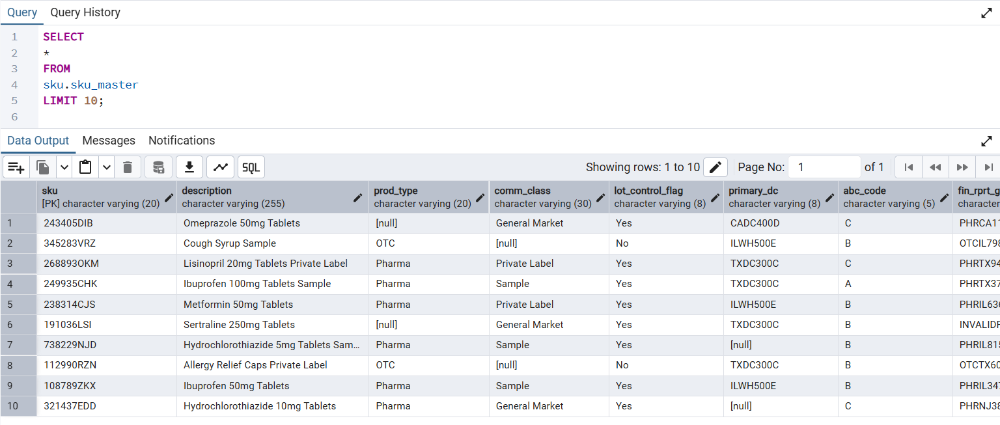
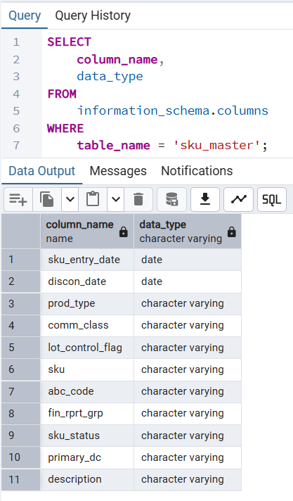
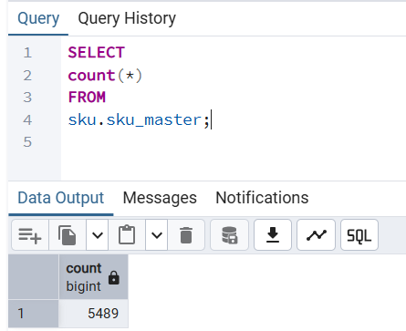
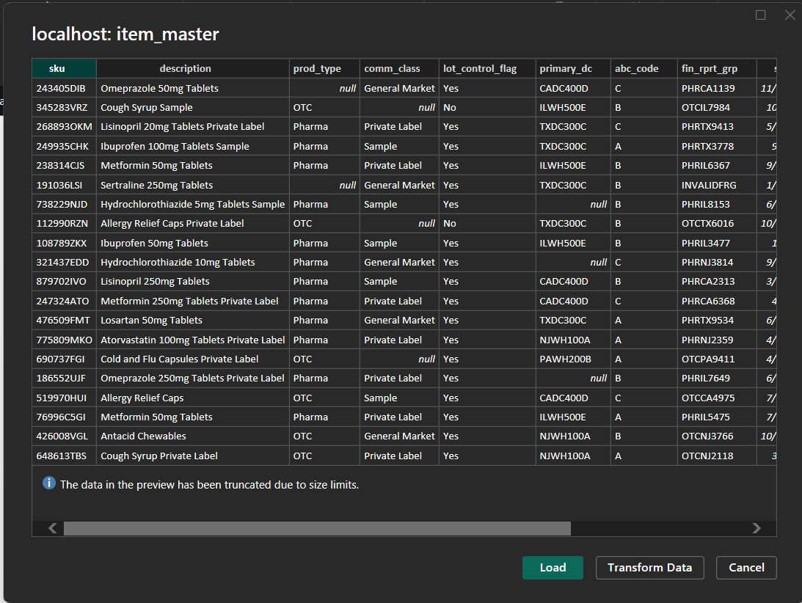
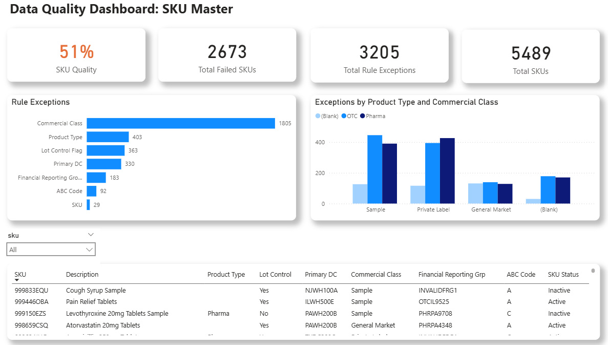

# 🔍 SKU Master Data Quality Object
## 📌 Project Overview

This project shows a real-world data quality monitoring worklow. The project uses a **synthetic SKU master dataset**; no real data was used in this project. The goal is to simulate common item master data issues, then build a repeatable process for detection, tracking, and visualization of data quality exceptions.

I leveraged AI and Python to generate the synthetic data set with intentional data errors. I then loaded the data a PostgreSQL database to serve as the source of truth. I used PowerBI to connect to this database and I evaluated the data using rule-based checks in the form of custom columns. I used this output to create a PowerBI dashboard designed to help data stewards monitor data quality and create actionables for data cleansing.

This project closely reflects my day-to-day work in inventory analytics and data governance.

**Note:** This project is an oversimplification of a real item master data structure. For this project I am relying on a **single** data table with synthetic data.

---

## 🧠 Problem Statement

Item master data is instrumental in supply chain, regulatory, and commercial operations. Issues with SKU set-ups can cause downstream failures in ERP, WMS, reporting, and compliance processes. Some of these issues not following SKU-naming rules, setting invalid attributes, or leaving critical fields blank. 

---

## 🏗️ Workflow and Tools Overview

ChatGPT & Python (Synthetic Data Generation)

  ⬇️
  
PostgresSQL (Relational Database Storage)

  ⬇️
  
PowerBI (Ingestion, Rule Validation, Visualization)

---

### 🛠️ Data Genration (Python)

-  Leveraged AI to create a [Python script](python/synth_sku_generator.py) used to generate a synthetic SKU master dataset with over 5000 SKUs. The script allowed me to customize output, including the # of SKUs to generate and the percentage of errors to insert in the dataset.
-  Included fields such as:
    -  SKU Number/Material Number
    -  Description with dosage form and strength
    -  Commercial Classification
    -  Brand/Label Type
-  Errors introduced
    -  Missing values
    -  Inconsistent SKU Numbers
    -  Conflicting values
 ---


### 🗄️ Data Storage (PostgreSQL)

Loaded the synthetic dataset of Pharma and OTC products (csv format) into a local PostgreSQL database using the pgAdmin 4 admin tool. The table design resembled that of the csv dataset. No cleansing was performed, only verification that all data was loaded properly.

**First 10 rows**

 

**Column Names and Data Types**



**Count of Records**



### 🔍 Data Ingestion and Data Quality Rules (Power BI)

-  I used PowerQuery to conenct to the local PostgreSQL database, and then loaded the data using using Import Mode so I could add Custom Columns.
-  Added Custom Columns to apply data rules to generate a boolean value. True = exception, False = no exception (data follows rule).
    -  SKU number must folllow a ######ABC naming format (6 integers, 3 chars)
    -  Description must contain commercial classification ('General Market', 'Sample', 'Private Label') and, conversely, Commercial Classification must match this description
    -  Product Type must be 'OTC' or 'Pharma' with no blanks
    -  Lot Control has to be set to 'Yes' for all products with no blanks
    -  Primary Distribution Center must be one of five valid DCs with no blanks
    -  ABC Code for accounting and cycle-count activities must be entered with no blank ('A', 'B', 'C')

**Initial Load into PowerQuery** [M code](powerquery/m_code.txt)




### 📊 Dashboard Features, Insights, and Action Plan

The design of the PowerBI dashboard includes:
-  Overall data quality score
-  Count of SKUs failing one or more rules
-  Count of rule failures across the entire dataset
-  Count of SKUs being considered in the analysis
-  Breakdown of rule failures by type
-  Breakdown of SKUs failing one or more rules by Product Type and Commercial Classification
-  Table of all SKUs failine one or more rules, with the option to filter/search by SKU.

**Dashoard**



**The dashboard is reporting a 51% data quality level**, or 2673 out of 5489 SKUs not meeting all data quality rules. There is work to get done, but we are able to divide the work into managable actionables for quick improvements

Several **actionables** can be determined by using this dashboard

**Quick Wins**
  -  SKU naming conventions can be easily resolved. This only affects 5 SKUs but it is low-hanging fruit. This would be a quick win.
  -  Lot Control flag should be set as YES to on all SKUs. This update should be quick using SQL, and would correct ### if SKUs. This is also a quick win.
      ```
      UPDATE table
      SET lot_control_flag = 'Yes';
      ```     
  **Long Term Actionables**
  -  Incorrect Primary DC or blank values would require input from Supply Chain and Logistics teams, but this only affects ### of SKUs.
  -  SKU Description and Commercial Classification. SKU description should include the Commercial Classification for 'Samples' and 'Private Label'. Determining and confirming these values would require input from commercial teams.
  -  ABC code updates would require Inventory Control or Finance/Accounting input. These are critical for cycle-counts at the DC and for audit purposes. Financial Reporting Group can also be considered in these discussions.

**Proposed Action Plan**

-  Tackle the quick wins first. These may only take a day or two to complete. Mass updates to SQL tables should still be performed with caution and be done in a Quality environment first.
-  Set time with subject matter experts to verify values (Description vs Commercial Classification, Incorrect/Missing DC, ABC Codes)

Long term actionables will require input for validation and verification of planned corrections, but this can happen in tandem with enforcement of rules for all new SKUs and SKU updates, along with additional training in best data entry and data stewardship practices.

### Realistic Two Week Progress Report

After two weeks these are some realistic accomplishments:
- SKU names updated (SQL)
- Lot Control Flag updated (SQL)
- Partial Descripion and Copmmercial Classification synchroniazation based on initial feedback from SMEs (SQL)
- ABC Codes updated based on SME input relying on past sales volume (SQL)

---

## 🗂️ Repository Structure

```text
/
├── powerquery/           # Power Query (M) scripts for PostgreSQL ingestion and ETL
├── powerbi/              # Power BI dashboard file
├── docs/                 # Screenshots 
├── python/               # Python script 
└── README.md


